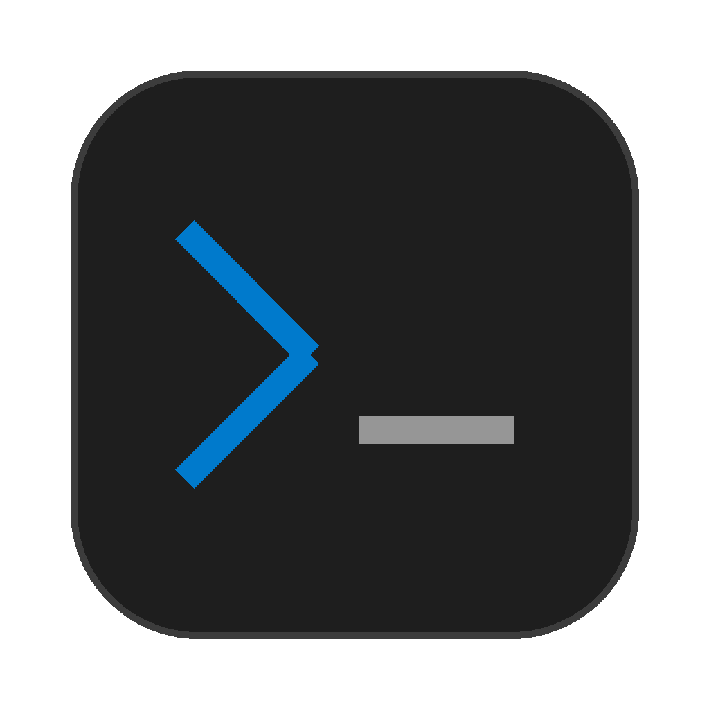

<p align="center">
  
</p>

<h1 align="center">Terma</h1>

<p align="center">
  A lightweight, project-aware terminal multiplexer built for the modern era.
</p>

<p align="center">
  
  
  
</p>

---

## Screenshots

<!-- Add your screenshots here -->


## Features

- **Project-aware** — Organize terminal sessions by project directory
- **Session multiplexing** — Multiple named sessions per project, instant switching
- **Keyboard-first** — Full keyboard navigation with quick switch (`⌘P`)
- **Persistent layout** — Projects and sessions survive app restart
- **Native performance** — Built with Tauri v2 and Rust, not Electron
- **Dark theme** — VS Code Dark+ inspired color scheme

## Keyboard Shortcuts

| Shortcut | Action |
|----------|--------|
| `⌘N` | New session in active project |
| `⌘W` | Close active session |
| `⌘P` | Quick switch (fuzzy finder) |
| `⌘B` | Toggle sidebar |
| `⌘1-9` | Switch to session 1-9 |
| `⌘↑/↓` | Previous/next session |
| `⌘⇧↑/↓` | Previous/next project |

## Install

Download the latest `.dmg` from [Releases](https://github.com/user/terma/releases).

### Build from source

Prerequisites: [Node.js](https://nodejs.org/) 22+, [pnpm](https://pnpm.io/), [Rust](https://www.rust-lang.org/tools/install)

```bash
git clone https://github.com/user/terma.git
cd terma
pnpm install
pnpm tauri build
```

The built app will be in `src-tauri/target/release/bundle/`.

## Development

```bash
pnpm tauri dev        # Run in development mode
pnpm test             # Run tests
pnpm build            # Frontend build only
```

## Tech Stack

- **Frontend**: React 19, TypeScript, Tailwind CSS v4, [xterm.js](https://xtermjs.org/)
- **Backend**: Rust, [Tauri v2](https://v2.tauri.app/), [portable-pty](https://crates.io/crates/portable-pty)
- **Build**: Vite 7, pnpm

## Architecture

```
src/
├── components/
│   ├── Sidebar/        # Project tree, session list
│   ├── Terminal/        # xterm.js wrapper, panel, header
│   ├── StatusBar.tsx    # Bottom status bar
│   └── QuickSwitch.tsx  # ⌘P fuzzy finder
├── context/             # React Context + reducer
├── hooks/               # usePty, useConfig, useKeyboardShortcuts
└── types/               # TypeScript interfaces

src-tauri/src/
├── lib.rs               # App setup, command registration
├── pty.rs               # PTY session management
├── commands.rs          # Tauri IPC commands
└── config.rs            # Config persistence
```

## License

[MIT](LICENSE)
